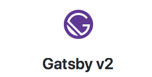

アウトプットを増やしていこうと思い至ってから、何度かブログを作っては納得のいく出来にならず、今回やっと `Gatsby` に落ち着きました。せっかく作るなら人に見られるものを意識して作りたいし、技術的にも面白そうなものをなものを使ってみたい、そんな理由から `Gatsby` を採用しています。今回はざっと紹介だけでコードは載せないです。

## `Gatsby` にした理由
最初は `React` でスクラッチしてみようと考えてたのですが、 `create-react-app` で作ると手軽な半面、基本的に `eject` させない限り `webpack.config.json` が編集できなくて `SSR` だったり要件が複雑になってくると作りづらい箇所が増えてきて不向きかなと感じたので見送りました。ブログだと `静的サイトジェネレータ` の利点も大きく、以前から気になっていた `Gatsby` で作ることにしました。

### `静的サイトジェネレータ` なので `SSR` 不要
`Qiita` や `はてなブログ` に載せない独立したブログという性質上、検索にかかるのとSNSでシェア出来るのは最重要の課題でした。`SPA` にしてしまうと最近の `Googleクローラ` は `JavaScript` を処理してくれるかもしれないけど、SNS上にシェアした際に `OGP` が拾えず全ページ共通のタイトルと画像しか表示させられません。この時点で `SSR` か `静的サイトジェネレータ` のどちらかで実装するのは決まっていました。

`Gatsby` の場合は `静的サイトジェネレータ` なのであらかじめ生成した静的ファイルをホストするだけでサイトが公開できます。`SSR` だとアクセスされる度に処理を実行する必要があり無駄が多いのでコンテンツの変化がほぼ無いブログには不向きです。

ほかの静的サイトジェネレータだと `Hugo` や `Jekyll` もあるのだけど、今回はモダンなフロントエンド構成で実装されている `Gatsby` を採用しました。静的サイトジェネレータでありながら、ページにアクセスしたあとは `SPA` と同様に `JavaScript` 内でページをルーティングしてくれるのでユーザー体験が良いです。

### `React` で書ける
フロントエンドが好きでその中でも `React` に力を入れています。`React` は `Vue.js` と比べてコードが増えるとか難しいとよく言われるのですが、純粋な `JavaScript` で記述されているのでその点においては他よりも柔軟に設計できて周辺技術の対応も早いイメージがあります。2019/02に `React 16.8` で `React Hooks` が正式にリリースされてからは記述量が多くなりがちなクラスコンポーネントを書かず、少ないコード量で同等の処理を表現できるようになりました。

`Vue.js` や `Anguler` のように1ファイルに `HTML` `CSS` `JavaScript` を記述するタイプはパーサーの対応が難しく、たとえばコミュニティの大きな `Vue.js` でも `TypeScript` 対応が遅れていたりするので、個人的には `React` のほうが安心して使えます。

`Vue` の `静的サイトジェネレータ` なら `VuePress` があるし、`Vue` で作りたい方はこちらもおすすめです。

## 全体の構成
特に変わったことはしておらず、`GitHub` でソースコードと記事のマークダウンを管理して、`Netlify` にデプロイさせています。ライトな使い方ならこれが一番簡単で相性がいいです。

## 今後
記事が増えてきたら全文検索サービスの `algolia` を導入してみたり、記事内のコードを `Prism` というライブラリで表示しているのですが、シンタックスの付け方が `VS Code` と違うのに違和感があるので合わせられたらいいな。

